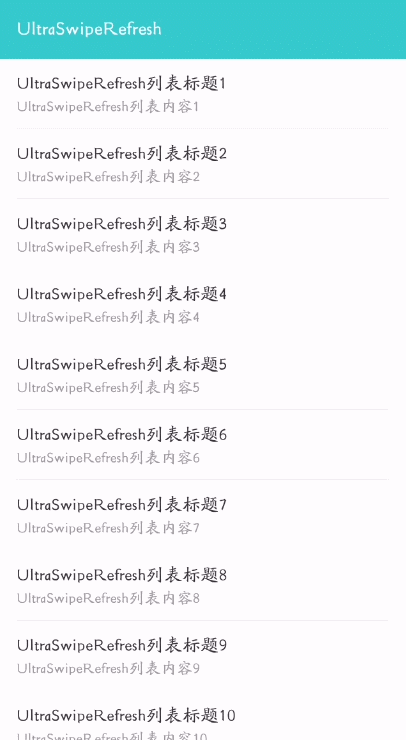
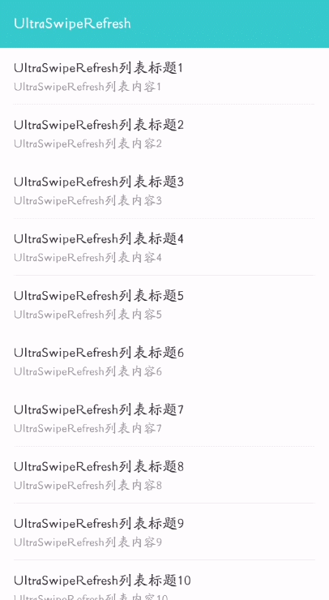

# UltraSwipeRefresh

[](https://raw.githubusercontent.com/jenly1314/UltraSwipeRefresh/master/app/release/app-release.apk)
[](https://repo1.maven.org/maven2/com/github/jenly1314/UltraSwipeRefresh)
[](https://jitpack.io/#jenly1314/UltraSwipeRefresh)
[](https://circleci.com/gh/jenly1314/UltraSwipeRefresh)
[](https://android-arsenal.com/api?level=21)
[](https://opensource.org/licenses/mit-license.php)

**UltraSwipeRefresh**：一个可带来极致体验的 **Compose** 刷新组件；支持下拉刷新和上拉加载，可完美替代官方的 **SwipeRefresh**；并且支持的功能更多，可扩展性更强。

> **UltraSwipeRefresh** 的设计之初，主要参考了谷歌官方的[SwipeRefresh](https://github.com/google/accompanist/tree/main/swiperefresh) 和第三方的[SmartRefreshLayout](https://github.com/scwang90/SmartRefreshLayout) ，吸取了其优秀的设计思想；致力于打造一个极致体验的 **Compose** 刷新组件。

> 这里简单的概括下 **UltraSwipeRefresh** 主要的一些功能特色：支持多种滑动方式：平移、固定内容、固定在背后、固定在前面； **headerIndicator** 和 **footerIndicator** 可任意定制，并且 **Header** 和 **Footer** 的样式与滑动模式可随意组合。


## Gif 展示


> 你也可以直接下载 [演示App](https://raw.githubusercontent.com/jenly1314/UltraSwipeRefresh/master/app/release/app-release.apk) 体验效果

## 引入

### Gradle:

1. 在Project的 **build.gradle** 或 **setting.gradle** 中添加远程仓库

    ```gradle
    repositories {
        //...
        mavenCentral()
    }
    ```

2. 在Module的 **build.gradle** 里面添加引入依赖项

    ```gradle
    // 极致体验的Compose刷新组件 (*必须)
    implementation 'com.github.jenly1314.UltraSwipeRefresh:refresh:1.1.2'
   
    // 经典样式的指示器 (可选)
    implementation 'com.github.jenly1314.UltraSwipeRefresh:refresh-indicator-classic:1.1.2'
    // Lottie动画指示器 (可选)
    implementation 'com.github.jenly1314.UltraSwipeRefresh:refresh-indicator-lottie:1.1.2'
    // 进度条样式的指示器 (可选)
    implementation 'com.github.jenly1314.UltraSwipeRefresh:refresh-indicator-progress:1.1.2'
    ```

## 使用

### UltraSwipeRefresh

**Compose** 组件的使用大都比较直观，一般只需看一下 **Composable** 函数对应的参数说明基本就会使用了。

#### UltraSwipeRefresh参数说明

```kotlin
/**
 * UltraSwipeRefresh：一个可带来极致体验的Compose刷新组件；支持下拉刷新和上拉加载，可完美替代官方的SwipeRefresh；并且支持的功能更多，可扩展性更强。
 *
 * @param state 状态：主要用于控制和观察[UltraSwipeRefresh]；比如：控制下拉刷新和上拉加载和观察其状态。
 * @param onRefresh 在完成滑动刷新手势时触发调用
 * @param onLoadMore 在完成滑动加载手势时触发调用
 * @param modifier 修饰符：用于装饰或添加Compose UI元素的行为。具体更详细的说明可查看[Modifier]
 * @param headerScrollMode 在进行滑动刷新时Header的滑动模式；具体更详细的样式说明可查看[NestedScrollMode]
 * @param footerScrollMode 在进行滑动加载更多时Footer的滑动模式；具体更详细的样式说明可查看[NestedScrollMode]
 * @param refreshEnabled 是否启用下拉刷新
 * @param loadMoreEnabled 是否启用上拉加载
 * @param refreshTriggerRate 触发滑动刷新的最小滑动比例；比例基于[headerIndicator]的高度；默认为：1
 * @param loadMoreTriggerRate 触发滑动加载更多最小滑动比例；比例基于[footerIndicator]的高度；默认为：1
 * @param headerMaxOffsetRate 向下滑动时[headerIndicator]可滑动的最大偏移比例；比例基于[headerIndicator]的高度；默认为：2
 * @param footerMaxOffsetRate 向上滑动时[footerIndicator]可滑动的最大偏移比例；比例基于[footerIndicator]的高度；默认为：2
 * @param dragMultiplier 触发下拉刷新或上拉加载时的阻力系数；值越小，阻力越大；默认为：0.5
 * @param finishDelayMillis 完成时延时时间；让完成时的中间状态[UltraSwipeRefreshState.isFinishing]停留一会儿，定格的展示提示内容；默认：500毫秒
 * @param vibrateEnabled 是否启用振动，如果启用则当滑动偏移量满足触发刷新或触发加载更多时，会有振动效果；默认为：false
 * @param headerIndicator 下拉刷新时顶部显示的Header指示器
 * @param footerIndicator 上拉加载更多时底部显示的Footer指示器
 * @param content 可进行滑动刷新或加载更多所包含的内容
 */
```

#### UltraSwipeRefresh使用示例

```kotlin
/**
 * 完整代码示例
 */
@Composable
fun UltraSwipeRefreshSample() {

   val state = rememberUltraSwipeRefreshState()

   var itemCount by remember { mutableIntStateOf(20) }

   LaunchedEffect(state.isRefreshing) {
      if (state.isRefreshing) {
         // TODO 刷新的逻辑处理，此处的延时只是为了演示效果
         delay(2000)
         itemCount = 20
         state.isRefreshing = false
      }
   }

   LaunchedEffect(state.isLoading) {
      if (state.isLoading) {
         // TODO 加载更多的逻辑处理，此处的延时只是为了演示效果
         delay(2000)
         itemCount += 20
         state.isLoading = false
      }
   }

   UltraSwipeRefresh(
      state = state,
      onRefresh = {
         state.isRefreshing = true
      },
      onLoadMore = {
         state.isLoading = true
      },
      modifier = Modifier.background(color = Color(0x7FEEEEEE)),
      headerScrollMode = NestedScrollMode.Translate,
      footerScrollMode = NestedScrollMode.Translate,
      headerIndicator = {
         ClassicRefreshHeader(it)
      },
      footerIndicator = {
         ClassicRefreshFooter(it)
      }
   ) {
      LazyColumn(Modifier.background(color = Color.White)) {
         repeat(itemCount) {
            item {
               Text(
                  text = "UltraSwipeRefresh列表Item${it + 1}",
                  modifier = Modifier.padding(horizontal = 16.dp, vertical = 10.dp),
                  color = Color(0xFF333333),
                  fontSize = 16.sp
               )
               Divider(
                  modifier = Modifier.padding(horizontal = 16.dp),
                  color = Color(0xFFF2F3F6)
               )
            }
         }
      }
   }
}

```

> 使用小提示：**headerIndicator/footerIndicator** 与 **headerScrollMode/footerScrollMode** 组合使用才更配哦。

### UltraSwipeRefreshTheme（v1.1.0新增）

UltraSwipeRefreshTheme：主要用于统一管理全局默认配置。

> 通常情况下，一个App使用的刷新样式是统一的，如果你需要进行全局统一刷新组件的样式时，可以通过`UltraSwipeRefreshTheme.config`来动态修改`UltraSwipeRefresh`的全局默认配置。

#### UltraSwipeRefreshTheme使用示例

```kotlin
// 全局设置默认的滑动模式
UltraSwipeRefreshTheme.config = UltraSwipeRefreshTheme.config.copy(
   headerScrollMode = NestedScrollMode.Translate, 
   footerScrollMode = NestedScrollMode.Translate,
)
```

### 指示器样式

这里罗列一下目前 **UltraSwipeRefresh** 所包含的一些Header和Footer指示器样式，方便快速查找与参考。

| 默认官方样式                                                                                                                          | 经典样式                                                                                                                              | 
|:--------------------------------------------------------------------------------------------------------------------------------|:----------------------------------------------------------------------------------------------------------------------------------|
| SwipeRefreshHeader                                                                                                              | ClassicRefreshHeader                                                                                                              | 
|                                                                                    |                                                                                    | 
| SwipeRefreshFooter                                                                                                              | ClassicRefreshFooter                                                                                                              | 
| [对应的代码示例](app/src/main/java/com/king/ultraswiperefresh/app/sample/SwipeRefreshIndicatorSample.kt) | [对应的代码示例](app/src/main/java/com/king/ultraswiperefresh/app/sample/ClassicRefreshIndicatorSample.kt) | 

| 进度条样式                                                                                                | Lottie动画样式                                                                                                             | 
|:-----------------------------------------------------------------------------------------------------|:--------------------------------------------------------------------------------------------------------------------------------------|
| ProgressRefreshHeader                                                                                | LottieRefreshHeader                                                                                                                   | 
|                                                      |                                                                                         | 
| ProgressRefreshFooter                                                                                | LottieRefreshFooter                                                                                                                   | 
| [对应的代码示例](app/src/main/java/com/king/ultraswiperefresh/app/sample/ProgressRefreshIndicatorSample.kt) | [对应的代码示例](app/src/main/java/com/king/ultraswiperefresh/app/sample/LottieRefreshIndicatorSample.kt) | 


> 如果以上的指示器效果都不满足你的需求，你也可以自定义去实现Header和Footer的指示器，也可以直接使用Lottie动画样式的指示器来可快速接入任何Lottie动画。

更多使用详情，请查看[app](app)中的源码使用示例或直接查看 [API帮助文档](https://jitpack.io/com/github/jenly1314/UltraSwipeRefresh/latest/javadoc/)

### 相关推荐

#### [CodeTextField](https://github.com/jenly1314/CodeTextField)一个使用 Compose 实现的验证码输入框。
#### [compose-component](https://github.com/jenly1314/compose-component) 一个Jetpack Compose的组件库；主要提供了一些小组件，便于快速使用。

## 版本记录

#### 待发布版本 （[提前体验](test.md)）

#### v1.1.2 ：2024-5-22
* 修复BUG：部分机型在某些特定场景下，出现“无法再次触发下拉刷新”的问题。（[#7](https://github.com/jenly1314/UltraSwipeRefresh/issues/7)）

#### v1.1.1 ：2024-4-20
* 修复BUG：刷新状态变化太快时，导致”完成时的定格提示动画”不执行的问题。（[#4](https://github.com/jenly1314/UltraSwipeRefresh/issues/4)）
* 优化一些细节

#### v1.1.0 ：2023-12-17

* 新增`UltraSwipeRefreshTheme`：用于统一管理全局默认配置
* 新增参数`finishDelayMillis`：完成时延时时间（可用于定格展示提示内容）
* 新增参数`vibrateEnabled`：是否启用振动（当滑动偏移量满足触发刷新或触发加载更多时，会有振动效果）

#### v1.0.0 ：2023-12-3

* UltraSwipeRefresh初始版本

## 赞赏

如果您喜欢UltraSwipeRefresh，或感觉UltraSwipeRefresh帮助到了您，可以点右上角“Star”支持一下，您的支持就是我的动力，谢谢 :smiley:
<p>您也可以扫描下面的二维码，请作者喝杯咖啡 :coffee:

<div>
   
</div>

## 关于我

| 我的博客                                                                                | GitHub                                                                                  | Gitee                                                                                  | CSDN                                                                                 | 博客园                                                                            |
|:------------------------------------------------------------------------------------|:----------------------------------------------------------------------------------------|:---------------------------------------------------------------------------------------|:-------------------------------------------------------------------------------------|:-------------------------------------------------------------------------------|
| <a title="我的博客" href="https://jenly1314.github.io" target="_blank">Jenly's Blog</a> | <a title="GitHub开源项目" href="https://github.com/jenly1314" target="_blank">jenly1314</a> | <a title="Gitee开源项目" href="https://gitee.com/jenly1314" target="_blank">jenly1314</a>  | <a title="CSDN博客" href="http://blog.csdn.net/jenly121" target="_blank">jenly121</a>  | <a title="博客园" href="https://www.cnblogs.com/jenly" target="_blank">jenly</a>  |

## 联系我

| 微信公众号        | Gmail邮箱                                                                          | QQ邮箱                                                                              | QQ群                                                                                                                       | QQ群                                                                                                                       |
|:-------------|:---------------------------------------------------------------------------------|:----------------------------------------------------------------------------------|:--------------------------------------------------------------------------------------------------------------------------|:--------------------------------------------------------------------------------------------------------------------------|
| [Jenly666](http://weixin.qq.com/r/wzpWTuPEQL4-ract92-R) | <a title="给我发邮件" href="mailto:jenly1314@gmail.com" target="_blank">jenly1314</a> | <a title="给我发邮件" href="mailto:jenly1314@vip.qq.com" target="_blank">jenly1314</a> | <a title="点击加入QQ群" href="https://qm.qq.com/cgi-bin/qm/qr?k=6_RukjAhwjAdDHEk2G7nph-o8fBFFzZz" target="_blank">20867961</a> | <a title="点击加入QQ群" href="https://qm.qq.com/cgi-bin/qm/qr?k=Z9pobM8bzAW7tM_8xC31W8IcbIl0A-zT" target="_blank">64020761</a> |

<div>
   
</div>
