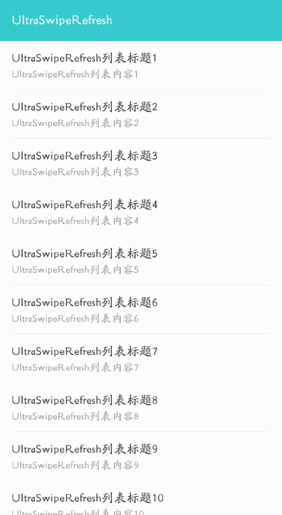
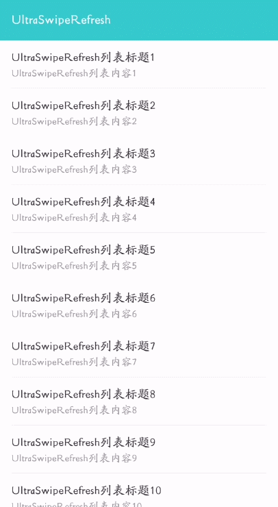

# UltraSwipeRefresh

[](https://repo1.maven.org/maven2/com/github/jenly1314/UltraSwipeRefresh)
[](https://jitpack.io/#jenly1314/UltraSwipeRefresh)
[](https://github.com/jenly1314/UltraSwipeRefresh/actions/workflows/build.yml)
[](https://raw.githubusercontent.com/jenly1314/UltraSwipeRefresh/master/app/release/app-release.apk)
[](https://developer.android.com/guide/topics/manifest/uses-sdk-element#ApiLevels)
[](https://opensource.org/licenses/mit)

**UltraSwipeRefresh**：一个可带来极致体验的 **Compose** 刷新组件；支持下拉刷新和上拉加载，可完美替代官方的 **SwipeRefresh**；功能更丰富，扩展性更强。

> **UltraSwipeRefresh** 在设计之初，主要参考了谷歌官方的 [SwipeRefresh](https://github.com/google/accompanist/tree/v0.36.0/swiperefresh) 和第三方的 [SmartRefreshLayout](https://github.com/scwang90/SmartRefreshLayout) ，在充分借鉴两者优秀设计理念的基础上，致力于打造一个拥有极致体验的 **Compose** 刷新组件。

## 功能特色

- 🌀 **多种滑动模式**：提供`Translate`(平移)、`FixedContent`(固定内容)、`FixedBehind`(固定在背后)、`FixedFront`(固定在前面) 等滑动交互模式，适配各类使用场景。
- 🎨 **可完全定制UI**：支持通过 `headerIndicator`/`footerIndicator` 完全自定义指示器，满足深度定制需求。
- ✨ **灵活配置方案**：可自由组合任意滑动模式与指示器样式，轻松实现个性化刷新效果。
- 🏠 **二级内容支持**：支持 Header/Footer 二级内容（Header 类似“淘宝二楼”，为了对称，Footer 顺带加了个“地下室”），满足多层级交互场景。（ **新版本即将发布** ）

## 效果展示


> 你也可以直接下载 [演示App](https://raw.githubusercontent.com/jenly1314/UltraSwipeRefresh/master/app/release/app-release.apk) 体验效果

## 引入

### Gradle:

1. 在Project的 **build.gradle** 或 **setting.gradle** 中添加远程仓库

    ```gradle
    repositories {
        //...
        mavenCentral()
    }
    ```

2. 在Module的 **build.gradle** 中添加依赖项

    ```gradle
    // 极致体验的Compose刷新组件 (*必须)
    implementation 'com.github.jenly1314.UltraSwipeRefresh:refresh:1.4.2'

    // 经典样式的指示器 (可选)
    implementation 'com.github.jenly1314.UltraSwipeRefresh:refresh-indicator-classic:1.4.2'
    // Lottie动画指示器 (可选)
    implementation 'com.github.jenly1314.UltraSwipeRefresh:refresh-indicator-lottie:1.4.2'
    // 进度条样式的指示器 (可选)
    implementation 'com.github.jenly1314.UltraSwipeRefresh:refresh-indicator-progress:1.4.2'
    ```

## 使用

### UltraSwipeRefresh

**Compose** 组件的使用大都比较直观，一般看一下 **Composable** 函数对应的参数说明基本就会使用了。

#### UltraSwipeRefresh参数说明

```kotlin
/**
 * UltraSwipeRefresh：一个可带来极致体验的 Compose 刷新组件，支持下拉刷新和上拉加载，
 * 可完美替代官方的 SwipeRefresh，功能更丰富，扩展性更强。
 *
 * @param state 状态对象，用于控制和观察 [UltraSwipeRefresh] 的状态，如下拉刷新和上拉加载的触发与控制
 * @param onRefresh 下拉刷新手势触发完成时的回调
 * @param onLoadMore 上拉加载手势触发完成时的回调
 * @param modifier 修饰符，用于装饰或扩展 Compose UI 元素的行为；详细说明见 [Modifier]
 * @param headerScrollMode 下拉刷新时 Header 的滑动模式；详细说明见 [NestedScrollMode]
 * @param footerScrollMode 上拉加载时 Footer 的滑动模式；详细说明见 [NestedScrollMode]
 * @param refreshEnabled 是否启用下拉刷新
 * @param loadMoreEnabled 是否启用上拉加载
 * @param refreshTriggerRate 触发下拉刷新的最小滑动比例，基于 [headerIndicator] 的高度；默认值：1
 * @param loadMoreTriggerRate 触发上拉加载的最小滑动比例，基于 [footerIndicator] 的高度；默认值：1
 * @param headerSecondaryEnabled 是否启用 Header 二级内容功能
 * @param footerSecondaryEnabled 是否启用 Footer 二级内容功能
 * @param headerSecondaryBehavior Header 二级内容交互行为模式；详细说明见 [SecondaryBehavior]
 * @param footerSecondaryBehavior Footer 二级内容交互行为模式；详细说明见 [SecondaryBehavior]
 * @param headerSecondaryPreview 在 [UltraSwipeHeaderState.ReleaseToSecondary] 状态下是否可提前预览 Header 二级内容
 * @param footerSecondaryPreview 在 [UltraSwipeFooterState.ReleaseToSecondary] 状态下是否可提前预览 Footer 二级内容
 * @param headerSecondaryTriggerRate 触发 Header 二级内容的最小滑动比例，基于 [headerIndicator] 的高度；默认值：2
 * @param footerSecondaryTriggerRate 触发 Footer 二级内容的最小滑动比例，基于 [footerIndicator] 的高度；默认值：2
 * @param headerMaxOffsetRate 下拉时 [headerIndicator] 的最大滑动偏移比例，基于其自身高度；默认值：3
 * @param footerMaxOffsetRate 上拉时 [footerIndicator] 的最大滑动偏移比例，基于其自身高度；默认值：3
 * @param dragMultiplier 滑动时的阻力系数，值越小阻力越大；默认值：0.5
 * @param finishDelayMillis 完成状态的停留时长（毫秒），便于展示提示内容；默认值：500
 * @param vibrationEnabled 是否启用振动反馈。启用后，滑动偏移量达到阈值时将触发振动；默认值：false
 * @param vibrationMillis 触发刷新或加载时的振动时长（毫秒）；默认值：25
 * @param alwaysScrollable 是否始终允许滚动。设为 true 时，不受刷新/加载状态限制，始终可滚动；默认值：false
 * @param onCollapseScroll 可选回调，当 Header/Footer 收起时用于同步调整列表位置，消除视觉回弹
 * @param headerIndicator 下拉刷新时顶部显示的 Header 指示器
 * @param footerIndicator 上拉加载时底部显示的 Footer 指示器
 * @param headerSecondaryContent Header 二级内容（可选）
 * @param footerSecondaryContent Footer 二级内容（可选）
 * @param contentContainer [content] 的父容器，便于统一管理
 * @param content 可进行刷新或加载所包含的内容区域
 */
```

#### UltraSwipeRefresh使用示例

使用`UltraSwipeRefresh`实现一个经典样式的刷新与加载示例：

```kotlin
@Composable
fun UltraSwipeRefreshSample() {

    val state = rememberUltraSwipeRefreshState()
    var itemCount by remember { mutableIntStateOf(20) }
    val coroutineScope = rememberCoroutineScope()
    val lazyListState = rememberLazyListState()

    UltraSwipeRefresh(
        state = state,
        onRefresh = {
            coroutineScope.launch {
                state.isRefreshing = true
                // TODO 刷新的逻辑处理，此处的延时只是为了演示效果
                delay(2000)
                itemCount = 20
                state.isRefreshing = false
            }
        },
        onLoadMore = {
            coroutineScope.launch {
                state.isLoading = true
                // TODO 加载更多的逻辑处理，此处的延时只是为了演示效果
                delay(2000)
                itemCount += 20
                state.isLoading = false
            }
        },
        modifier = Modifier.background(color = Color(0x7FEEEEEE)),
        headerScrollMode = NestedScrollMode.Translate,
        footerScrollMode = NestedScrollMode.Translate,
        onCollapseScroll = {
            // 小于0时表示：由下拉刷新收起时触发的，大于0时表示：由上拉加载收起时触发的
            if (it > 0) {
                // 指示器收起时滚动列表位置，消除视觉回弹
                lazyListState.animateScrollBy(it)
            }
        },
        headerIndicator = {
            ClassicRefreshHeader(it)
        },
        footerIndicator = {
            ClassicRefreshFooter(it)
        }
    ) {
        LazyColumn(
            modifier = Modifier.fillMaxSize().background(color = Color.White),
            state = lazyListState,
        ) {
            repeat(itemCount) {
                item {
                    Text(
                        text = "UltraSwipeRefresh列表Item${it + 1}",
                        modifier = Modifier.padding(horizontal = 16.dp, vertical = 10.dp),
                        color = Color(0xFF333333),
                        fontSize = 16.sp
                    )
                    Divider(
                        modifier = Modifier.padding(horizontal = 16.dp),
                        color = Color(0xFFF2F3F6)
                    )
                }
            }
        }
    }
}

```

> 使用小提示：**headerIndicator/footerIndicator** 与 **headerScrollMode/footerScrollMode** 组合使用，以获得最佳滑动体验！

### UltraSwipeRefreshTheme

UltraSwipeRefreshTheme：主要用于统一管理全局默认配置。

> 通常情况下，一个App使用的刷新样式是统一的，如果你需要进行全局统一刷新组件的样式时，可以通过`UltraSwipeRefreshTheme.config`来动态修改`UltraSwipeRefresh`的全局默认配置。

#### UltraSwipeRefreshTheme使用示例

```kotlin
// 全局设置默认的滑动模式 （建议在Application的onCreate中进行配置）
UltraSwipeRefreshTheme.config = UltraSwipeRefreshTheme.config.copy(
   headerScrollMode = NestedScrollMode.Translate,
   footerScrollMode = NestedScrollMode.Translate,
)
```
> 更多参数配置可查看：`UltraSwipeRefreshTheme.config` 的定义，这里就不一一举例了。

### 指示器样式

这里罗列一下目前 **UltraSwipeRefresh** 所提供的一些Header和Footer指示器样式与示例，以供参考。

| 默认官方样式                                                                                                | 经典样式                                                                                                                                                                                                           |
|:------------------------------------------------------------------------------------------------------|:---------------------------------------------------------------------------------------------------------------------------------------------------------------------------------------------------------------|
| SwipeRefreshHeader                                                                                    | ClassicRefreshHeader                                                                                                                                                                                           |
|                                                          |                                                                                                                                                                 |
| SwipeRefreshFooter                                                                                    | ClassicRefreshFooter                                                                                                                                                                                           |
| [官方默认的刷新样式示例](app/src/main/java/com/king/ultraswiperefresh/app/sample/SwipeRefreshIndicatorSample.kt) | [经典刷新样式示例](app/src/main/java/com/king/ultraswiperefresh/app/sample/ClassicRefreshIndicatorSample.kt)  /  [经典刷新自动加载示例](app/src/main/java/com/king/ultraswiperefresh/app/sample/ClassicRefreshAutoLoadSample.kt) |

| 进度条样式                                                                                           | Lottie动画样式                                                                                                                            |
|:-----------------------------------------------------------------------------------------------------|:--------------------------------------------------------------------------------------------------------------------------------------|
| ProgressRefreshHeader                                                                                | LottieRefreshHeader                                                                                                                   |
|                                                      |                                                                                         |
| ProgressRefreshFooter                                                                                | LottieRefreshFooter                                                                                                                   |
| [进度条刷新样式示例](app/src/main/java/com/king/ultraswiperefresh/app/sample/ProgressRefreshIndicatorSample.kt) | [Lottie动画刷新样式示例](app/src/main/java/com/king/ultraswiperefresh/app/sample/LottieRefreshIndicatorSample.kt)                                    |

> 如果以上的指示器效果都不满足你的需求，你可以自定义去实现Header和Footer对应的指示器，也可以直接使用Lottie动画样式的指示器，来快速接入任何Lottie动画。

更多使用详情，请查看[app](app)中的源码使用示例或直接查看 [API帮助文档](https://jenly1314.github.io/UltraSwipeRefresh/api/)

## 相关推荐

- [CodeTextField](https://github.com/jenly1314/CodeTextField)一个使用 Compose 实现的验证码输入框。
- [compose-component](https://github.com/jenly1314/compose-component) 一个Jetpack Compose的组件库；主要提供了一些小组件，便于快速使用。
- [SuperSwipeRefreshLayout](https://github.com/jenly1314/SuperSwipeRefreshLayout) 是在SwipeRefreshLayout的基础之上扩展修改，让其支持上拉刷新。
- [SuperSlidingPaneLayout](https://github.com/jenly1314/SuperSlidingPaneLayout) 是在SlidingPaneLayout的基础之上扩展修改，新增几种不同的侧滑效果。
- [SuperTextView](https://github.com/jenly1314/SuperTextView) 一个在TextView的基础上扩展了几种动画效果的控件。
- [LoadingView](https://github.com/jenly1314/LoadingView) 一个圆弧加载过渡动画，圆弧个数，大小，弧度，渐变颜色，完全可配。
- [WaveView](https://github.com/jenly1314/WaveView) 一个水波纹动画控件视图，支持波纹数，波纹振幅，波纹颜色，波纹速度，波纹方向等属性完全可配。
- [GiftSurfaceView](https://github.com/jenly1314/GiftSurfaceView) 一个适用于直播间送礼物拼图案的动画控件。
- [FlutteringLayout](https://github.com/jenly1314/FlutteringLayout) 一个适用于直播间点赞桃心飘动效果的控件。
- [DragPolygonView](https://github.com/jenly1314/DragPolygonView) 一个支持可拖动多边形，支持通过拖拽多边形的角改变其形状的任意多边形控件。
- [CircleProgressView](https://github.com/jenly1314/CircleProgressView) 一个圆形的进度动画控件，动画效果纵享丝滑。
- [ArcSeekBar](https://github.com/jenly1314/ArcSeekBar) 一个弧形的拖动条进度控件，配置参数完全可定制化。
- [DrawBoard](https://github.com/jenly1314/DrawBoard) 一个自定义View实现的画板；方便对图片进行编辑和各种涂鸦相关操作。

<!-- end -->

## 版本日志

#### 待发布版本 （[提前体验](test.md)）
- 新增：支持Header/Footer二级内容，提供完整的配置参数
 - 新增参数`headerSecondaryContent` / `footerSecondaryContent`：Header/Footer二级内容
 - 新增参数`headerSecondaryEnabled` / `footerSecondaryEnabled`：是否启用Header/Footer二级内容功能
 - 新增参数`headerSecondaryBehavior` / `footerSecondaryBehavior`：Header/Footer二级内容交互行为模式
 - 新增参数`headerSecondaryPreview` / `footerSecondaryPreview`：Header/Footer二级内容是否可提前预览
 - 新增参数`headerSecondaryTriggerRate` / `footerSecondaryTriggerRate`：触发Header/Footer二级的最小滑动比例
- 优化：为新增的 Header/Footer 二级内容功能进行整体适配与交互优化

#### v1.4.2 ：2025-9-6
- 优化显示细节（[#38](https://github.com/jenly1314/UltraSwipeRefresh/issues/38)）

#### [查看更多版本日志](CHANGELOG.md)

---


